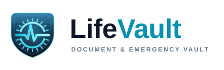

<p align="center">
  
</p>

<p align="center">
  <b>Smart Personal Document &amp; Emergency Management System</b><br>
  <sub>Local-first desktop prototype built with Python, CustomTkinter and SQLite.</sub>
</p>

# LifeVault

**Smart Personal Document & Emergency Management System** is a local-first college desktop prototype built with Python, CustomTkinter, and SQLite.

## Features

- Local email/password registration with salted PBKDF2-HMAC-SHA256 password hashes
- Random vault encryption key protected by both the master password and a one-time recovery code
- Optional Google OAuth Desktop sign-in for identity verification; a local master password still unlocks each encrypted vault
- Encrypted document attachments, optional file attachments, expiry tracking, live search, and category/status filters
- Emergency contacts with edit, delete, and phone-handler actions
- Emergency profile, critical-document Emergency Pack, and quick-access Emergency Mode
- Project-defined readiness score, activity log, demo data, and 15-minute inactivity lock

## Install and Run

Requirements: Python 3.11 or newer. From the project folder:

```powershell
python -m pip install -r requirements.txt
python main.py
```

On Windows, `Run_LifeVault.bat` checks for Python, installs the listed requirements, and launches the app.

Create a local account and keep the recovery code shown during registration. It is displayed once. If both the master password and recovery code are lost, the encrypted vault cannot be recovered. Forgot Password uses this recovery code locally; it does not send email.

## Google Sign-In (Optional)

Create a Google OAuth Client ID of type **Desktop app**, download its JSON, name it `credentials.json`, and place it beside `main.py`. See [Google_Login_Setup.txt](Google_Login_Setup.txt). Google is used for basic identity verification only. The app requests OpenID, email, and basic profile scopes; it does not request Gmail, Drive, or Contacts access. Google verification does not replace the local master password needed to unlock encrypted data.

## Demo

Sign in, open **Settings → Load Demo Data**, then explore Dashboard, Document Vault, Readiness, Emergency Pack, and Emergency Mode. Sample contact details and documents are fictional; sample document files are encrypted before being stored.

## Branding

The logo lives in [`assets/`](assets/) — a shield holding a combination dial, opened left
and right so an ECG lifeline runs straight through it. See [`assets/README.md`](assets/README.md)
for the full kit (SVG + PNG exports, favicon, app icon, palette) and
[`assets/preview.html`](assets/preview.html) for the visual spec sheet.

## Project Note

This is a college/local prototype, not a production security, medical, legal, or emergency-response product. Data is stored on the local computer. Protect the computer and recovery code, and do not use demo data as real emergency information.
